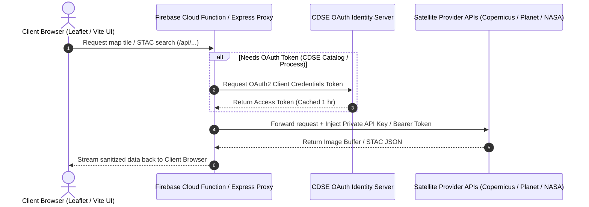

# Alythia — Technical API & Pipeline Documentation

This document provides a comprehensive breakdown of all API endpoints, backend proxy services, satellite data ingestion pipelines, authentication flows, and security protocols engineered into the **Alythia** platform.

---

## 1. Executive Architectural Overview

The Alythia platform ingests multi-spectral imagery, thermal anomaly detections, and atmospheric pollution metrics from multiple commercial and governmental satellite networks:
* **Copernicus Data Space Ecosystem (CDSE) / Sentinel Hub**: Sentinel-2 (MSI) & Sentinel-5P (TROPOMI)
* **Planet Labs**: PlanetScope high-resolution monthly basemaps
* **NASA FIRMS**: VIIRS & MODIS active fire / thermal anomaly tracking

### Why a Proxy Architecture?
Directly making requests from the browser to third-party satellite providers exposes private API keys and client secrets in the browser's Network tab. To prevent credential leakage, Alythia employs a **Secure Backend Proxy Architecture**:



---

## 2. Environment Credentials Configuration

All sensitive API keys and secrets are declared in `.env` (for local development) and `functions/.env` (for production Firebase Cloud Functions):

| Environment Variable | Service | Description | Security Level |
| :--- | :--- | :--- | :---: |
| `PLANET_API_KEY` | Planet Labs | High-resolution satellite basemap tile key | 🔒 Private |
| `FIRMS_MAP_KEY` | NASA FIRMS | NASA EOSDIS active fire WMS tile key | 🔒 Private |
| `SH_INSTANCE_ID` | Copernicus CDSE | Sentinel-2 OGC WMS instance identifier | 🔒 Private |
| `SH_S5P_INSTANCE_ID` | Copernicus CDSE | Sentinel-5P TROPOMI WMS instance identifier | 🔒 Private |
| `SH_CLIENT_ID` | Copernicus CDSE | OAuth2 client identifier for STAC Catalog & Process APIs | 🔒 Private |
| `SH_CLIENT_SECRET` | Copernicus CDSE | OAuth2 client secret for token generation | 🔒 Private |

---

## 3. Detailed Endpoint Specification

### 3.1 Planet Labs Tile Proxy
* **Endpoint**: `GET /api/planet-tiles/:mosaic/:z/:x/:y`
* **Source**: `https://tiles0.planet.com/basemaps/v1/planet-tiles/`
* **Purpose**: Serves high-resolution PlanetScope monthly basemap tiles to the interactive map viewer.
* **Process Flow**:
  1. The client Leaflet map issues standard XYZ tile requests (e.g., `/api/planet-tiles/global_monthly_2024_05/12/1204/1540`).
  2. The proxy extracts URL parameters (`mosaic`, `z`, `x`, `y`).
  3. The proxy appends `PLANET_API_KEY` from `process.env`.
  4. The HTTPS stream is piped directly to the response header without storing files on disk.

### 3.2 NASA FIRMS Thermal WMS Proxy
* **Endpoint**: `GET /api/firms-wms`
* **Source**: `https://firms.modaps.eosdis.nasa.gov/mapserver/wms/fires/`
* **Purpose**: Renders real-time and historical thermal anomaly / active fire layer overlays.
* **Process Flow**:
  1. Leaflet sends standard WMS bounding box (`BBOX`) and dimensions (`WIDTH`, `HEIGHT`).
  2. The proxy extracts query parameters and appends `FIRMS_MAP_KEY`.
  3. Renders PNG map tiles showing thermal hotspots over target facility coordinates.

### 3.3 Copernicus Sentinel-2 WMS Proxy
* **Endpoint**: `GET /api/copernicus-wms`
* **Source**: `https://sh.dataspace.copernicus.eu/ogc/wms/`
* **Purpose**: Renders true-color and false-color infrared multi-spectral optical imagery from Sentinel-2.
* **Process Flow**:
  1. The client requests specific WMS layer combinations (e.g., `TRUE-COLOR`, `NDVI`, `SHORTWAVE-INFRARED`).
  2. The proxy injects `SH_INSTANCE_ID` into the CDSE OGC endpoint.
  3. Returns raw PNG image buffers to the map canvas.

### 3.4 Copernicus Sentinel-5P TROPOMI WMS Proxy
* **Endpoint**: `GET /api/s5p-wms`
* **Source**: `https://sh.dataspace.copernicus.eu/ogc/wms/`
* **Purpose**: Renders atmospheric column density maps ($\text{CH}_4$ Methane concentration, $\text{NO}_2$, $\text{CO}$).
* **Process Flow**:
  1. Requests TROPOMI satellite composite layers for specified date ranges.
  2. Uses `SH_S5P_INSTANCE_ID` to authenticate against CDSE's Sentinel-5P server.
  3. Streams atmospheric plume visualization overlays.

### 3.5 Copernicus STAC Search Catalog API
* **Endpoint**: `POST /api/sh-catalog`
* **Source**: `https://sh.dataspace.copernicus.eu/catalog/v1/search`
* **Purpose**: Performs SpatioTemporal Asset Catalog (STAC) queries to identify cloud-free satellite acquisitions over an Area of Interest (AOI).
* **OAuth2 Token Exchange**:
  ```javascript
  // Automatic OAuth2 Client Credentials Flow
  async function getCdseToken() {
    if (cdseTokenCache && Date.now() < cdseTokenExpiry) return cdseTokenCache;
    
    const response = await fetch('https://identity.dataspace.copernicus.eu/auth/realms/CDSE/protocol/openid-connect/token', {
      method: 'POST',
      headers: { 'Content-Type': 'application/x-www-form-urlencoded' },
      body: new URLSearchParams({
        grant_type: 'client_credentials',
        client_id: process.env.SH_CLIENT_ID,
        client_secret: process.env.SH_CLIENT_SECRET
      })
    });
    const data = await response.json();
    cdseTokenCache = data.access_token;
    cdseTokenExpiry = Date.now() + (data.expires_in - 60) * 1000;
    return cdseTokenCache;
  }
  ```
* **Payload Request**: Accepts GeoJSON geometry bounding box, date ranges, and cloud cover percentage thresholds.
* **Response**: JSON array of available satellite scenes with acquisition timestamps and orbit metadata.

### 3.6 Copernicus Custom Band Math Process API
* **Endpoint**: `POST /api/sh-process`
* **Source**: `https://sh.dataspace.copernicus.eu/api/v1/process`
* **Purpose**: Executes custom Evalscripts (Javascript band math executed on CDSE GPU clusters) to compute custom vegetation indices, methane anomaly calculations, or thermal differences.
* **Payload Request**: Accepts Evalscript string, input dataset specifications, and output resolution parameters.
* **Response**: Returns raw 16-bit GeoTIFF or PNG image buffers.

---

## 4. User Access Authorization & Security Model

Alythia combines **Firebase Authentication (Google Sign-In)** with **Firestore Role-Based Access Control (RBAC)**:

### User Onboarding Flow
1. **Google OAuth Sign-In**: User authenticates with Google via Firebase Auth.
2. **Registration in Pending Queue**:
   * If the user is logging in for the first time, a record is created in Firestore with `status: 'pending'`, `role: 'user'`, and all pillar permissions set to `false`.
   * The user is immediately redirected to the **Access Request Pending Authorization** screen (`#view-pending-approval`).
3. **Admin Approval**:
   * Admins inspect the request in **System Settings $\rightarrow$ Profiles Settings**.
   * Clicking **Approve Access** updates the user document to `status: 'approved'` and enables assigned pillar permissions (*Operational Efficiency, Asset Security, Sustainability, API Management*).
4. **Revocation & Blocking**:
   * Admins can revoke access at any time via the **User Access & Permissions Modal** (`status: 'rejected'`), instantly preventing platform entry.

---

## 5. Deployment Architecture

| Environment | Host Server | Execution Command | Port / Route |
| :--- | :--- | :--- | :--- |
| **Local Dev** | Express.js (`server/index.js`) | `npm run dev:server` | `http://localhost:3000/api/*` |
| **Production** | Firebase Cloud Functions (`functions/index.js`) | `npx firebase deploy --only functions` | `https://alythia.com/api/*` |

Both environments share identical code logic, ensuring seamless testing and production parity!
