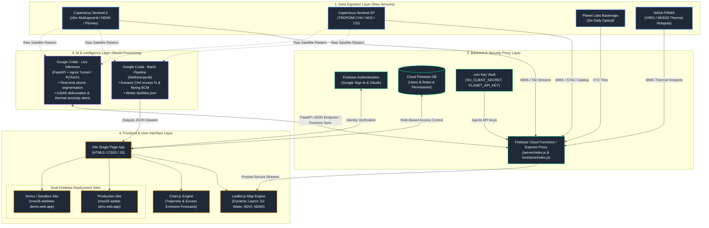

# Aletheia — End-to-End System Architecture

This document presents the visual architecture map of **Aletheia**, showing how data flows across the **4 Core Layers**: Data, Backend, Intelligence (AI/Colab), and Frontend.

---

## 1. Visual Architecture Diagram



---

## 2. Layer-by-Layer Technical Breakdown

| Layer | Official Layer Name | Technologies Used | Key Responsibilities |
| :--- | :--- | :--- | :--- |
| **Layer 1** | **Data Ingestion Layer** | • Sentinel-2 & Sentinel-5P (Copernicus CDSE)<br>• PlanetScope (Planet Labs)<br>• VIIRS & MODIS (NASA FIRMS) | Provider of raw satellite tiles, atmospheric spectra, and thermal hotspot imagery. |
| **Layer 2** | **Backend Proxy & Security Layer** | • Node.js / Express Proxy (`server/index.js`)<br>• Firebase Cloud Functions (`functions/index.js`)<br>• Firebase Auth (Google Sign-In)<br>• Cloud Firestore Database | Secret key protection (`.env`), CORS management, secure WMS stream proxying, user role verification (Admin/User). |
| **Layer 3** | **AI & Intelligence Layer** | • **Google Colab Batch** (`Aletheia.ipynb`)<br>• **Google Colab Live** (FastAPI + `ngrok` / PyTorch)<br>• Scikit-learn, OpenCV, GDAL, SentinelHub Python SDK | High-performance model execution: methane concentration excess, flaring volumes, thermal anomaly detection, outfall plume segmentation. |
| **Layer 4** | **Frontend & UI Presentation Layer** | • Vite / HTML5 / Vanilla CSS<br>• Leaflet.js (Map & Satellite Layers)<br>• Chart.js (Trajectory Graphs)<br>• Firebase Hosting (`main` & `demo`) | Interactive map exploration, facility reporting cards, dynamic metric charts, and multi-pillar visualization (*Sustainability*, *Operational Efficiency*, *Asset Security*). |

---

## 3. How Data Flows During a User Interaction

```
[ User Clicks "Analyze Facility" ]
             │
             ├───> 1. Frontend requests proxied imagery ──────> Node/Firebase Proxy ──> Satellite APIs (Sentinel/Planet)
             │
             ├───> 2. Frontend reads pre-computed metrics ────> facilities.json (Generated by Colab Batch Pipeline)
             │
             └───> 3. Frontend triggers live AI inference ────> FastAPI / ngrok Tunnel ──> Google Colab GPU (PyTorch Model)
                                                                                                  │
                                                                                                  ▼
[ Real-Time Heatmap / Plume Result ] <───────────────────────────────────────────────── Returns Insights JSON
```
